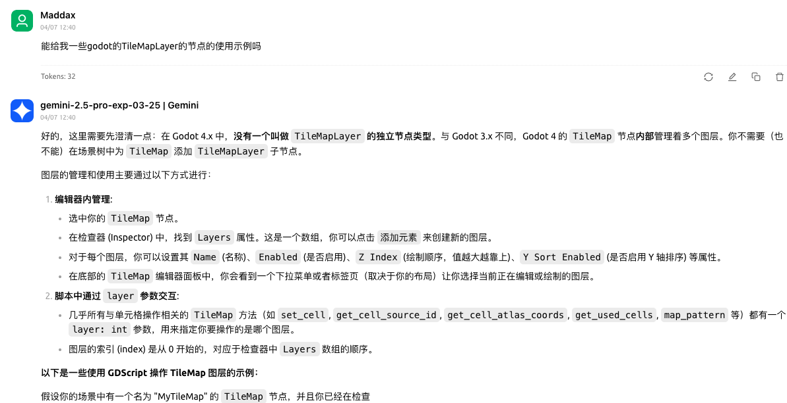
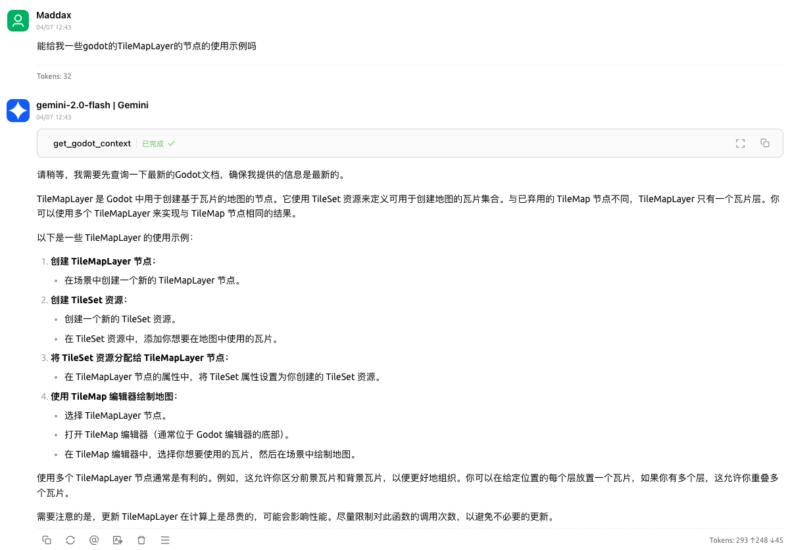

# A MCP server for Godot RAG

This MCP server is used to provide Godot documentation to the Godot RAG model.

# Screenshot

## Before using



## After using



# MCP server config

```json
{
  "mcpServers": {
    "godot-rag": {
      "command": "python",
      "args": [
        "<path to the server script 'main.py'>",
        "-d",
        "<path to the chroma_db on your computer>",
        "-c",
        "<name of the collection in the chroma_db>"
      ]
    }
  }
}
```

# Setup

```bash
uv venv --python 3.12
source ./.venv/bin/activate
uv sync
cp .env.example .env.local
```

# Initiation steps

```bash
# clone godot docs
python download_godot_docs.py
# convert rst to markdown
python convert_rst2md.py
# chunk markdown files
python chunker.py -i artifacts
# create vector database
python vectorizer.py -i artifacts/chunks/artifacts_chunks_SZ_400_O_20.jsonl
# python vectorizer_api.py -i artifacts/chunks/artifacts_chunks_SZ_400_O_20.jsonl -m BAAI/bge-m3
# start mcp server
python main.py -d artifacts/vector_stores/chroma_db -c artifacts_chunks_SZ_400_O_20_all-MiniLM-L6-v2
# python main_with_api.py -d artifacts/vector_stores/chroma_db -c artifacts_chunks_SZ_400_O_20_BAAI-bge-m3 -k <your openai api key>
```

# Debug

```bash
npx @modelcontextprotocol/inspector \
  uv \
  --directory . \
  run \
  main.py \
  --chromadb-path artifacts/vector_stores/chroma_db \
  --collection-name artifacts_chunks_SZ_400_O_20_all-MiniLM-L6-v2
```

# Use Another Model

- [all-MiniLM-L6-v2](https://huggingface.co/sentence-transformers/all-MiniLM-L6-v2)

- [bge-m3](https://huggingface.co/BAAI/bge-m3)

- [bge-large-zh-v1.5](https://huggingface.co/BAAI/bge-large-zh-v1.5)


# Other

mcp_godot_rag is indexed and certified by [MCP Review](https://mcpreview.com/mcp-servers/weekitmo/mcp_godot_rag)